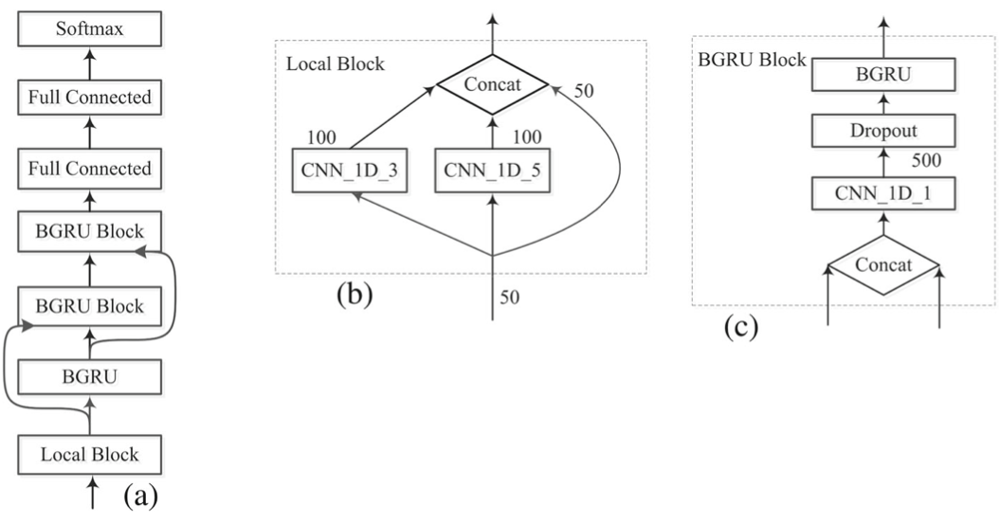

# 8-state Protein Secondary Structure Prediction

This is a Pytorch implementation of the model proposed in "Prediction of 8-state Protein Secondary Structures" (2018). It is a convolutional, residual, and recurrent neural network (CRRNN) that uses protein sequences and corresponding position-specific scoring matrices (PSSMs) to predict secondary structures. The model architecture is represented in the image below. 

* (a) CRRNN overall architecture
* (b)  A local block comprising of two 1D convolutional networks with 100 kernels, and the concatenation (Concat) of their outputs with the original input data. 
* (c) the BGRU block. The concatenation of input from the previous layer and before the previous layer is fed to the 1D convolutional filter. After reducing the dimensionality, the 500-dimensional data is transferred to the next BGRU layer.

Citation: Zhang, Buzhong & Li, Jinyan & Lü, Qiang. (2018). Prediction of 8-state protein secondary structures by a novel deep learning architecture. BMC Bioinformatics. 19. 10.1186/s12859-018-2280-5.  